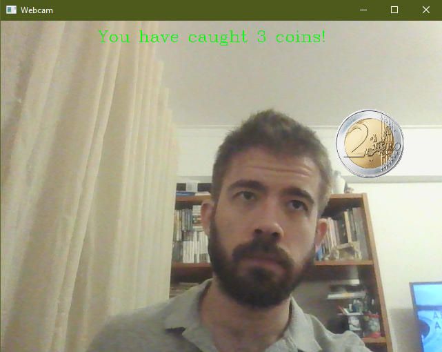

# Coin Catcher

A simple game where you catch coins with your head. Developed with OpenCV and C++



# How to run

1. Make sure your webcam is on.
2. You need to download at least `opencvgame.exe`, the `resources` folder and `opencv_world480.dll` and put them in the same folder.
3. Run `opencvgame.exe` either by double-clicking or running from the command line.
4. You can also run `opencvgame.exe hands` from the command line to play a version of the game where you use your hands instead of your head to catch the coins. Please note that this version uses more CPU.

<br/>

# How to build an OpenCV project in Windows via command line:

1. Download OpenCV for Windows (https://opencv.org/releases/) and install. Also make sure Visual Studio (we're using 2022 but other versions should be similar) or the MSVC compiler toolchain is present in your system.

2. If you're using an IDE (to write code, even though we're compiling by hand), make sure to add `C:/Users/pedro/Desktop/opencv/build/include` to the include path of the IDE/project so you can use IntelliSense.

    **Of course changing the paths to the location of your OpenCV install.**

3. Create your code file (e.g. opencvbasic.cpp ; content suggested by ChatGPT when prompted for "OpenCV's most basic program"): 

    ```
    #include <opencv2/opencv.hpp>

    int main() {
        // Load an image from the file system
        cv::Mat image = cv::imread("path/to/your/image.jpg");

        // Check if the image was loaded successfully
        if (image.empty()) {
            std::cout << "Error: Could not open or find the image!" << std::endl;
            return -1;
        }

        // Display the image in a window
        cv::imshow("OpenCV Basic Program", image);

        // Wait for a key press indefinitely (0 means wait forever)
        cv::waitKey(0);

        // Close all OpenCV windows
        cv::destroyAllWindows();

        return 0;
    }
    ```

4. The OpenCV download probably only had 64bit binaries (in the folder opencv\build there should be only a x64 subfolder and not a x86 one - https://answers.opencv.org/question/229256), so you have to use a 64bit compiler. This meands `Developer PowerShell for VS 2022` doesn't work because it's 32bit (there isn't a 64bit version as of VS 2022 - https://stackoverflow.com/a/70606900). Also, note that building with MingW/g++ doesn't work because the official Windows binaries are made for Visual Studio/MSVC. If you want to use MingW/g++, look for binaries online or build them yourself.

5. So instead open `x64 Native Tools Command Prompt for VS 2022` and in the command prompt `cd` to the directory of opencvbasic.cpp and then run:

    ```
    cl /EHsc /I "C:\Users\pedro\Desktop\opencv\build\include" .\opencvbasic.cpp /link "C:\Users\pedro\Desktop\opencv\build\x64\vc16\lib\opencv_world480.lib"
    ```

    **Make sure there are no trailing slashes in the include paths (https://stackoverflow.com/a/62404923)**

6. If you try to run the .exe, there will probably be an error such as:

    ```
    The code execution cannot proceed because opencv_world.dll was not found. Reinstalling the program may fix this problem.
    ```
    You could add `C:\Users\pedro\Desktop\opencv\build\x64\vc16\bin\` to your PATH environment variable, but you can also just copy `C:\Users\pedro\Desktop\opencv\build\x64\vc16\bin\opencv_world480.dll` to the folder where your `opencvbasic.exe` is.

7. You should be able to run your executable now.